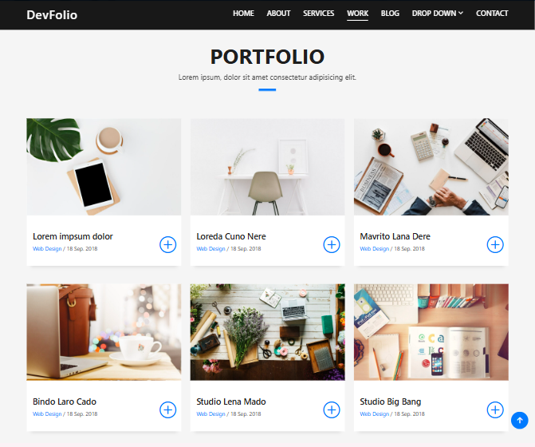

# 🎨 DevFolio - Bootstrap Portfolio Website

DevFolio is a **modern, responsive portfolio website** built with **Bootstrap 5**.  
This is my **first Bootstrap project**, where I practiced creating responsive layouts, navigation, and interactive components while keeping the design clean and user-friendly.  

---

## ✨ Features

- **📱 Responsive Design** → Works seamlessly across desktop, tablet, and mobile.  
- **🖥️ Bootstrap Navbar** → Sticky header with dropdowns and mobile toggle.  
- **📂 Portfolio Section** → Interactive project details section.  
- **🖼️ Swiper Slider** → Smooth image slider for project previews.  
- **💡 GLightbox** → Lightbox image viewer for portfolio images.  
- **⬆️ Back-to-Top Button** → Scroll-triggered button for better UX.  
- **🎨 Custom Styling** → Polished layout with custom CSS.
- Custom JavaScript for navbar, counters, and animations

---

## 🛠️ Built With
- [Bootstrap 5](https://getbootstrap.com/)  
- [Swiper.js](https://swiperjs.com/)  
- GLightbox  
- HTML5 / CSS3 / JavaScript

--- 
## 📸 Screenshot

---

## 🔗 Live Demo
👉 [View on GitHub Pages](https://dohahehe.github.io/DevFolio/)  
